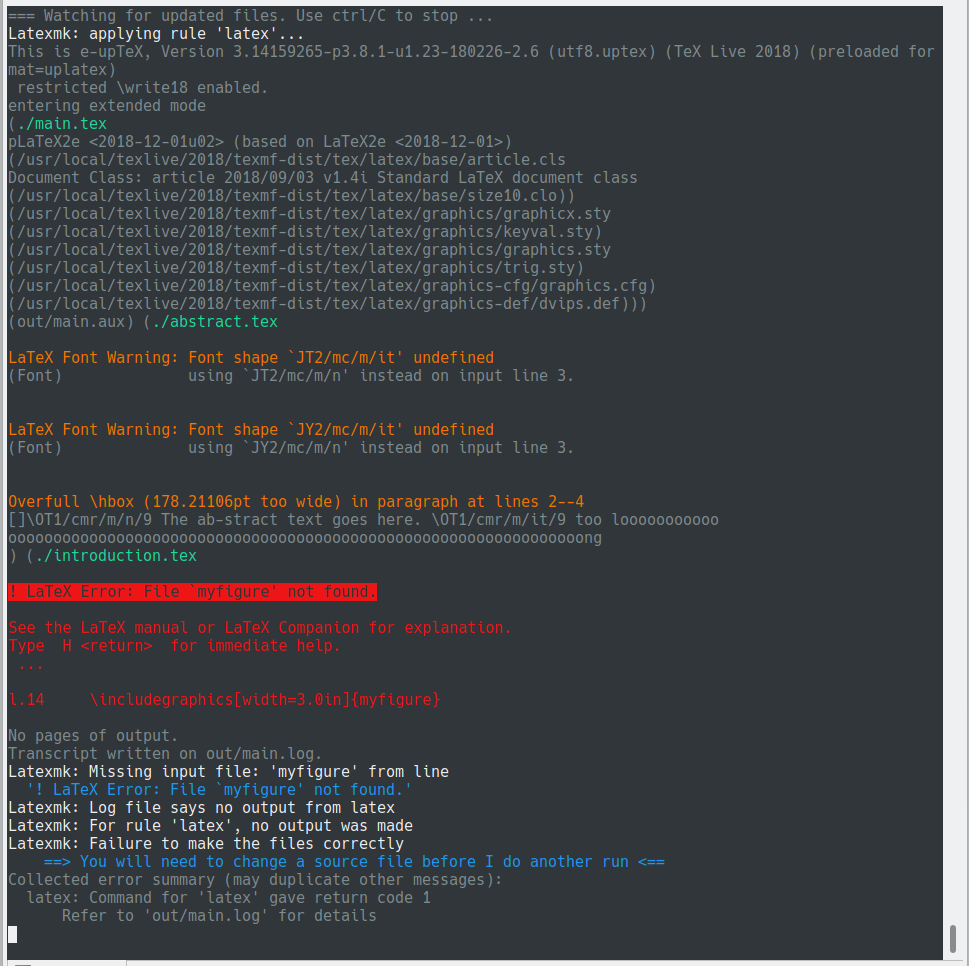

# :whale: arkark/latexmk

Useful LaTeX environment on Docker.

- **One command** to LaTeX environment
- Colored latexmk output
- Automatic conversion from `、` `。` to `，` `．`



## Installation

```sh
$ docker pull arkark/latexmk
```

## Usage

1. Prepare `main.tex` and some necessary files: e.g., other `*.tex` files, `*.bib` files, and image files.
2. Move to the directory.
3. Execute:
    ```sh
    $ docker run --rm -it -v $PWD:/workdir -u $(id -u):$(id -g) arkark/latexmk
    ```
4. Edit latex files and preview `out/main.pdf` while monitoring a latexmk's log.
5. Press `Ctrl+C` to exit.

## Options

The default latexmk file is [here](.latexmkrc), which uses uplatex.
If you want to customize it, add `.latexmkrc` file to the working directory.

For example, add the following `.latexmkrc` when using lualatex:

```perl
#!/usr/bin/env perl
$pdflatex = "lualatex --synctex=1 --interaction=nonstopmode --halt-on-error %O %S";
$max_repeat       = 5;
$pdf_mode         = 1;
$pdf_previewer    = ":";
$out_dir          = "out";
$pvc_view_file_via_temporary = 0;
```
